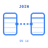
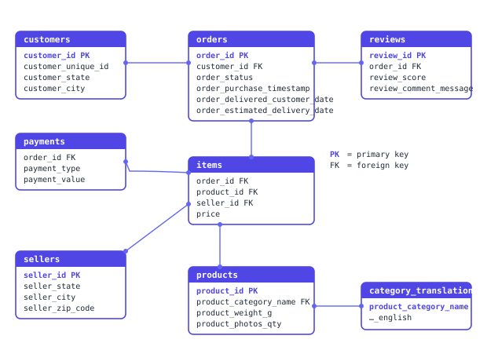
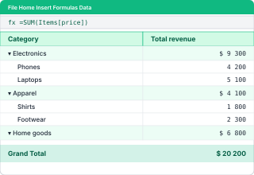
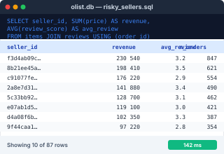
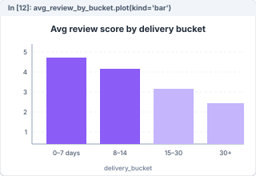
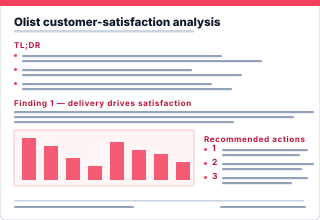

5-day intensive · MIT licensed

# Data Analytics Academy {: .hero-home__title }

A 20-hour program that takes you from "I've opened Excel a few times" to shipping an end-to-end analytics project on real data — Excel → SQL → Python → Power BI → AI.

[Start Day 1 →](curriculum/day1_excel/README.md){ .hero-home__cta }
[See the syllabus](#whats-inside){ .hero-home__cta .hero-home__cta--ghost }

   Beginner level
   Self-paced
   20 hours
   Capstone project
   Real Olist dataset

  
5days

  
25lessons

  
20hteaching

  
1capstone

  
100Kreal orders

<svg viewBox="0 0 320 340" fill="none" xmlns="http://www.w3.org/2000/svg">
  <g transform="translate(50 50) rotate(-5 110 80)">
    <rect width="220" height="150" rx="12" fill="white" fill-opacity="0.06" stroke="white" stroke-opacity="0.18" stroke-width="1"/>
    <line x1="20" y1="30" x2="200" y2="30" stroke="white" stroke-opacity="0.30" stroke-width="1"/>
    <line x1="20" y1="55" x2="200" y2="55" stroke="white" stroke-opacity="0.18" stroke-width="1"/>
    <line x1="20" y1="80" x2="200" y2="80" stroke="white" stroke-opacity="0.18" stroke-width="1"/>
    <line x1="20" y1="105" x2="200" y2="105" stroke="white" stroke-opacity="0.18" stroke-width="1"/>
    <line x1="20" y1="130" x2="200" y2="130" stroke="white" stroke-opacity="0.18" stroke-width="1"/>
    <line x1="85" y1="20" x2="85" y2="140" stroke="white" stroke-opacity="0.15" stroke-width="1"/>
    <line x1="145" y1="20" x2="145" y2="140" stroke="white" stroke-opacity="0.15" stroke-width="1"/>
  </g>
  <g transform="translate(35 130)">
    <rect width="250" height="190" rx="16" fill="white" fill-opacity="0.14" stroke="white" stroke-opacity="0.38" stroke-width="1"/>
    <g transform="translate(28 30)">
      <rect x="0"   y="80" width="22" height="60"  rx="3" fill="#a5b4fc"/>
      <rect x="34"  y="50" width="22" height="90"  rx="3" fill="#a5b4fc"/>
      <rect x="68"  y="70" width="22" height="70"  rx="3" fill="#a5b4fc"/>
      <rect x="102" y="30" width="22" height="110" rx="3" fill="#c4b5fd"/>
      <rect x="136" y="10" width="22" height="130" rx="3" fill="#fbbf24"/>
    </g>
    <path d="M 39 170 L 73 140 L 107 154 L 141 122 L 175 94 L 211 66"
          stroke="#fbbf24" stroke-width="3" fill="none"
          stroke-linecap="round" stroke-linejoin="round"/>
    <circle cx="39"  cy="170" r="4.5" fill="#fbbf24"/>
    <circle cx="73"  cy="140" r="4.5" fill="#fbbf24"/>
    <circle cx="107" cy="154" r="4.5" fill="#fbbf24"/>
    <circle cx="141" cy="122" r="4.5" fill="#fbbf24"/>
    <circle cx="175" cy="94"  r="4.5" fill="#fbbf24"/>
    <circle cx="211" cy="66"  r="4.5" fill="#fbbf24"/>
  </g>
</svg>

First, the mindset

## Before the tools — what an analyst actually does

Five days of tool fluency is what this site teaches. But the job an analyst is *paid* for is what you do with the tools — translating vague stakeholder questions into specific ones, sanity-checking your own numbers, picking the chart a non-analyst can read in five seconds.

[Read: What a data analyst actually does →](about_the_role.md){ .hero-home__cta }

What you'll learn

## Six concrete skills you'll walk away with

<strong>Clean a messy CSV in Excel.</strong> Tables, lookups, conditional aggregation, dates, pivots — the formula library every analyst leans on daily.

<strong>Query a real database with SQL.</strong> Joins across 4+ tables, CTEs, aggregations, and the empty-string-vs-NULL gotchas that catch most beginners.

<strong>Reproduce SQL analysis in pandas.</strong> Load, filter, group, and merge with row-count sanity checks — the habits that prevent silent wrong answers.

<strong>Build a 1-page interactive Power BI dashboard.</strong> Data model, DAX measures, slicers — a deliverable a non-analyst will actually click through.

<strong>Direct an AI assistant to do real analytics.</strong> The prompting templates, plan mode, and verification habits that make Claude Code a force multiplier instead of a confidently-wrong oracle.

<strong>Ship a stakeholder-ready 1-page report.</strong> Findings backed by traceable numbers, embedded charts, and recommendations a head of operations can act on.

Course at a glance

## Five days, five tools, one capstone

<a class="timeline-node" data-day="1" href="curriculum/day1_excel/README.md">

Day 1

Excel

4 hours · 5 lessons

</a>
<a class="timeline-node" data-day="2" href="curriculum/day2_sql/README.md">

Day 2

SQL

4 hours · 5 lessons

</a>
<a class="timeline-node" data-day="3" href="curriculum/day3_python/README.md">

Day 3

Python

4 hours · 5 lessons

</a>
<a class="timeline-node" data-day="4" href="curriculum/day4_powerbi/README.md">

Day 4

Power BI

4 hours · 5 lessons

</a>
<a class="timeline-node" data-day="5" href="curriculum/day5_claude_code/README.md">

Day 5

Claude Code

4 hours · 5 lessons

</a>

A taste of each day

## The code you'll actually write

<a class="code-card" data-day="1" href="curriculum/day1_excel/03_logic_lookups.md">
Day 1 · Excel formula
<pre class="code-card__code">=XLOOKUP(
  [@order_id],
  Reviews[order_id],
  Reviews[review_score],
  "")</pre>
See Day 1 →
</a>

<a class="code-card" data-day="2" href="curriculum/day2_sql/04_ctes.md">
Day 2 · SQL CTE
<pre class="code-card__code">WITH late AS (
  SELECT order_id
  FROM   orders
  WHERE  delivered_date >
         estimated_date
)
SELECT AVG(review_score)
FROM   reviews r
JOIN   late USING (order_id);</pre>
See Day 2 →
</a>

<a class="code-card" data-day="3" href="curriculum/day3_python/04_merge.md">
Day 3 · pandas
<pre class="code-card__code">n = len(orders)
merged = orders.merge(
  reviews,
  on='order_id',
  how='left',
)
assert len(merged) == n</pre>
See Day 3 →
</a>

<a class="code-card" data-day="4" href="curriculum/day4_powerbi/04_dax_measures.md">
Day 4 · DAX measure
<pre class="code-card__code">% Late =
  DIVIDE(
    CALCULATE([N Orders],
      Orders[is_late] = TRUE),
    [N Orders],
    0
  )</pre>
See Day 4 →
</a>

<a class="code-card" data-day="5" href="curriculum/day5_claude_code/02_prompting.md">
Day 5 · Claude prompt
<pre class="code-card__code">INPUT:  reviews.csv,
        score ≤ 2,
        non-empty comment

TASK:   classify into 6 themes
OUTPUT: theme, count, samples</pre>
See Day 5 →
</a>

Built around real data

## The Olist dataset — eight tables, one threaded story

<figure class="schema-figure">

<figcaption>~100,000 Brazilian e-commerce orders, 2017–2018. Every day's lesson joins a different subset of these tables.</figcaption>
</figure>

What you'll build by Friday

## Five concrete artifacts, one report

Day 1 · Excel

<h3 class="feature-row__title">Your first cut at the question, in a workbook</h3>

capstone/day1_excel/exploration.xlsx

Load two Olist CSVs, join them with XLOOKUP, derive delivery_days with date arithmetic, and ship two pivot tables — review-score distribution and delivery-vs-rating. Your first hypothesis: bad reviews correlate with slow delivery. You'll spend the next four days testing it.

<a class="feature-row__cta" href="capstone/day1_excel/README.md">See the Day 1 capstone task →</a>

Day 2 · SQL

<h3 class="feature-row__title">Two CSVs the rest of the week will pick up</h3>

capstone/day2_sql/risky_sellers.csv

Join four tables with a CTE-heavy query, compute per-seller revenue and average review score, and rank by financial-impact-of-bad-reviews. Hand-off artifacts that Day 3 (pandas) reproduces and Day 4 (Power BI) visualises.

<a class="feature-row__cta" href="capstone/day2_sql/README.md">See the Day 2 capstone task →</a>

Day 3 · pandas

<h3 class="feature-row__title">The headline chart, in a re-runnable notebook</h3>

capstone/day3_python/analysis.ipynb

Reproduce yesterday's SQL findings in pandas and reconcile them row-by-row — the most important debugging exercise of the week. Then bucket deliveries (0–7, 8–14, 15–30, 30+ days) and chart the average review per bucket. This chart becomes the visual centrepiece of the final report.

<a class="feature-row__cta" href="capstone/day3_python/README.md">See the Day 3 capstone task →</a>

Day 4 · Power BI

<h3 class="feature-row__title">A one-page interactive dashboard a stakeholder will click</h3>

capstone/day4_powerbi/dashboard.pbix

Set up the data model with seven relationships, write five DAX measures (SUM, AVERAGE, CALCULATE, DIVIDE), and build a one-page dashboard with three KPI cards, a category bar chart, a Brazilian-state map, and the bottom-10 risky sellers table.

<a class="feature-row__cta" href="capstone/day4_powerbi/README.md">See the Day 4 capstone task →</a>

Day 5 · Final report

<h3 class="feature-row__title">One page, three findings, recommendations the ops team can act on</h3>

capstone/day5_ai/final_report.md

Use Claude Code to draft a 1-page stakeholder report combining numbers from Days 1–4 and themes extracted from ~10,000 Portuguese review comments. Verify every number against your earlier work. Write the recommendations yourself — that's why an analyst is hired.

<a class="feature-row__cta" href="capstone/day5_ai/README.md">See the Day 5 capstone task →</a>

Skills you'll gain

## The toolbox

Excel Tables
XLOOKUP
SUMIFS &amp; COUNTIFS
Pivot tables
SQL SELECT
GROUP BY
JOIN
CTEs
SQLite
pandas DataFrames
groupby + agg
pd.merge
Jupyter
Power Query (M)
Data modeling
DAX measures
CALCULATE
Slicers &amp; cross-filtering
Claude Code
AI prompting
Plan mode
Verification habits
Theme extraction
Stakeholder reports

What's inside

## Your 5-day path

<a class="day-card" data-day="1" href="curriculum/day1_excel/README.md" markdown="1">

Day 1
Excel

4 hours · 5 lessons

Tables, references, sort/filter
Logic, lookups, conditional aggregation
Dates, cleaning, pivot tables

Start the day →
</a>

<a class="day-card" data-day="2" href="curriculum/day2_sql/README.md" markdown="1">

Day 2
SQL

4 hours · 5 lessons

SELECT, WHERE, GROUP BY
Joins across 4+ tables
CTEs and SQLite gotchas

Start the day →
</a>

<a class="day-card" data-day="3" href="curriculum/day3_python/README.md" markdown="1">

Day 3
Python

4 hours · 5 lessons

pandas DataFrames, filtering
merge with row-count sanity checks
Dates, plots, exports

Start the day →
</a>

<a class="day-card" data-day="4" href="curriculum/day4_powerbi/README.md" markdown="1">

Day 4
Power BI

4 hours · 5 lessons

Power Query and the data model
DAX measures, filter context
Interactive 1-page dashboard

Start the day →
</a>

<a class="day-card" data-day="5" href="curriculum/day5_claude_code/README.md" markdown="1">

Day 5
Claude Code

4 hours · 5 lessons

Prompting that works
Plan mode and verification
Theme extraction from text

Start the day →
</a>

“

Which sellers and product categories are driving low customer satisfaction at Olist — and what's the financial impact?

The capstone question · threaded through all 5 days

[See the capstone overview →](capstone/README.md){ .hero-home__cta .hero-home__cta--ghost }

Getting started

## What you'll need

| For | Tool | Cost |
|---|---|---|
| Day 1 | Excel (any modern version) | Microsoft 365 / one-time license |
| Day 2 | SQLite + [DB Browser for SQLite](https://sqlitebrowser.org/) | Free |
| Day 3 | Jupyter (local or [in-browser](https://jupyter.org/try-jupyter/lab/)) | Free |
| Day 4 | [Power BI Desktop](https://powerbi.microsoft.com/desktop/) | Free (Windows) |
| Day 5 | [Claude Code](https://claude.ai/code) | Free tier sufficient |

**Students** — head straight to [Day 1 — Excel](curriculum/day1_excel/README.md). **Instructors** — start with the [setup checklist](instructor/setup_checklist.md) and [timing notes](instructor/timing_notes.md).

Why this course

## What you actually get

  

    📊
    
      Real Olist dataset
      ~100K Brazilian e-commerce orders, 2017–2018
    
  

  

    🎯
    
      One capstone project
      Threaded through all 5 days, ships as a 1-page report
    
  

  

    🆓
    
      Free &amp; MIT-licensed
      Source on GitHub, no signup, no tracking
    
  

  

    🔁
    
      Self-paced
      20 hours of teaching, revisit any lesson anytime
    
  

  

    🛠️
    
      Production tools
      Excel · SQL · Python · Power BI · Claude Code
    
  

  

    🤖
    
      AI-native
      A full day on directing an AI assistant for real analytics work
    
  

After the course

## Where to go from here

Finished all five days plus the capstone? Read **[What to learn next →](next_steps.md)** — the books, courses, and habits that take a fluent beginner to a working analyst.

Where you start vs where you finish

## The five-day transformation

Monday morning
<h3 class="beforeafter__heading">When you start</h3>
<ul class="beforeafter__list">
<li>You've used Excel a handful of times but never trusted a pivot table</li>
<li>You've heard "just write a SQL query" and panicked</li>
<li>You think pandas is something you do in a zoo</li>
<li>You've opened Power BI and closed it again</li>
<li>You'd let an AI write code but couldn't verify whether it's right</li>
<li>You'd struggle to write a stakeholder report from scratch</li>
</ul>

Friday evening
<h3 class="beforeafter__heading">When you finish</h3>
<ul class="beforeafter__list">
<li>You ship a pivot table on 100K-row data without breaking the dates</li>
<li>You write a CTE that joins four tables and you can read your own query a week later</li>
<li>You reproduce that SQL in a pandas notebook and sanity-check every merge</li>
<li>You build a one-page Power BI dashboard a non-analyst will click through</li>
<li>You direct an AI to do real analytics work and you know which numbers to trust</li>
<li>You ship a 1-page stakeholder report with three findings and traceable numbers</li>
</ul>

Frequently asked

## Questions students actually ask

How long does the course take?

Five days at four hours each — twenty hours of teaching and one hour of capstone application per day. It's self-paced, so you can stretch it across a fortnight or compress it into a long weekend. The capstone takes most students another 2–3 hours after Day 5 to polish.

Do I need coding experience?

No. Day 1 starts from "what's a Table" in Excel. Day 3 starts from <code>import pandas as pd</code>. Day 5 starts from "this is how you sign in to Claude Code." If you've opened a spreadsheet a few times you're qualified. If you already know SQL and pandas, Days 1–3 will feel slow — skim them and jump to Day 4.

Is it really free?

Yes. MIT licensed, no signup, no email capture, no ads, no upsell. The source is on <a href="https://github.com/scripts-and-tables/daa">GitHub</a>. The reason it exists: it was built as an internal academy and the cost of releasing it publicly is essentially zero.

What tools do I need to install?

Excel (Microsoft 365 or any modern version), <a href="https://sqlitebrowser.org/">DB Browser for SQLite</a> (free), Jupyter (use <a href="https://jupyter.org/try-jupyter/lab/">JupyterLite in the browser</a> for zero install), <a href="https://powerbi.microsoft.com/desktop/">Power BI Desktop</a> (free, Windows only), and <a href="https://claude.ai/code">Claude Code</a> (free tier works). Detailed list in the <a href="#whats-inside">"What you'll need"</a> section below.

Can I do this on a Mac?

Mostly. Days 1, 2, 3, 5 work natively on macOS. Day 4 (Power BI Desktop) is Windows-only — Mac options are: run Windows in a VM (Parallels / UTM), use a remote Windows machine, or use Power BI Service (the browser version) which has fewer features but covers the Day 4 lessons.

Is there a certificate?

No paper certificate. The capstone — a 1-page stakeholder report on the Olist e-commerce dataset, with traceable numbers and an interactive dashboard — <em>is</em> the certificate. Push it to your GitHub, link it from your LinkedIn. A real public artifact carries more weight with hiring managers than a paid course completion badge.

What if I get stuck?

Every lesson ends with a "Common pitfalls" section that addresses the top 3–5 things that break for students. Every "Try it yourself" drill has a collapsible solution. The capstone has a rubric and worked-example references for every step. If you find something the course doesn't cover, <a href="https://github.com/scripts-and-tables/daa/issues">open an issue on GitHub</a>.

Who built this and why?

Originally written for an internal data analytics academy and released publicly under MIT. Built for working professionals who need real analytics fluency in five days and didn't want to commit to a six-month bootcamp. See <a href="about_the_role.md">"What a data analyst actually does"</a> for the framing.

About

## This course

Built for an internal analytics academy and released publicly under [MIT](https://github.com/scripts-and-tables/daa/blob/main/LICENSE). Source code and all materials: **[github.com/scripts-and-tables/daa](https://github.com/scripts-and-tables/daa)**.

Data Analytics Academy · 5 days · free
<a class="sticky-cta__btn" href="curriculum/day1_excel/README.md">Start Day 1 →</a>

